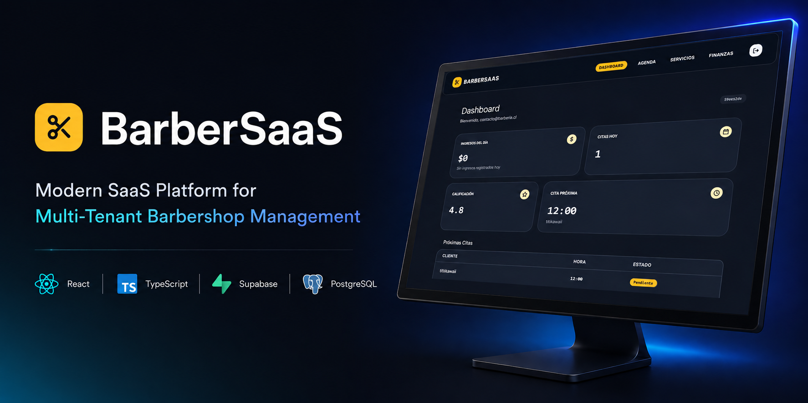
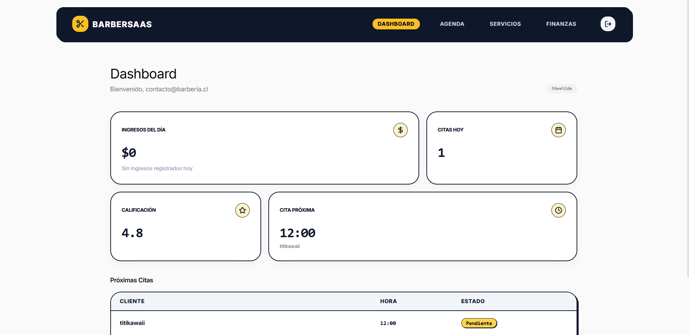
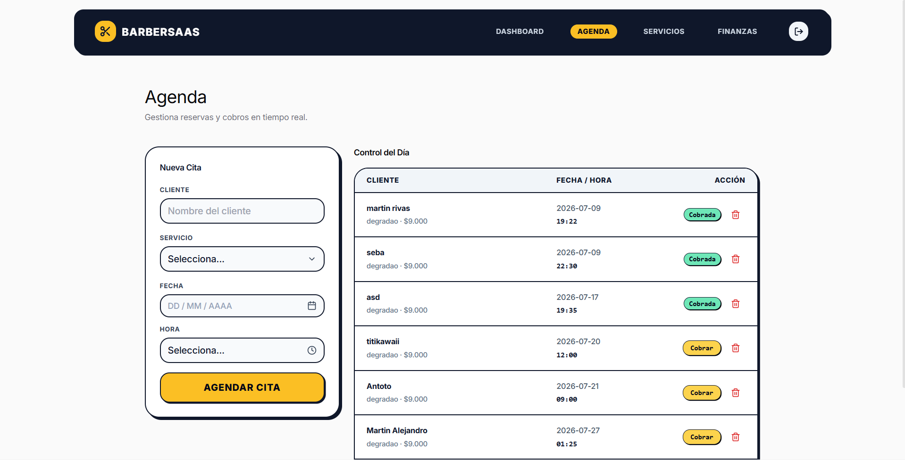
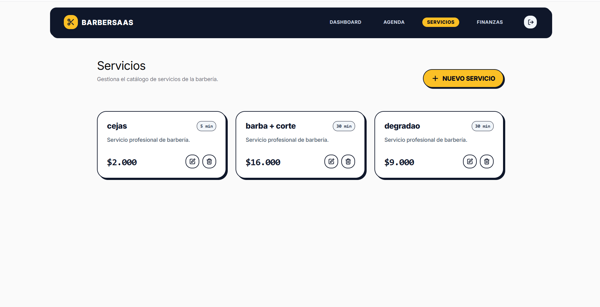
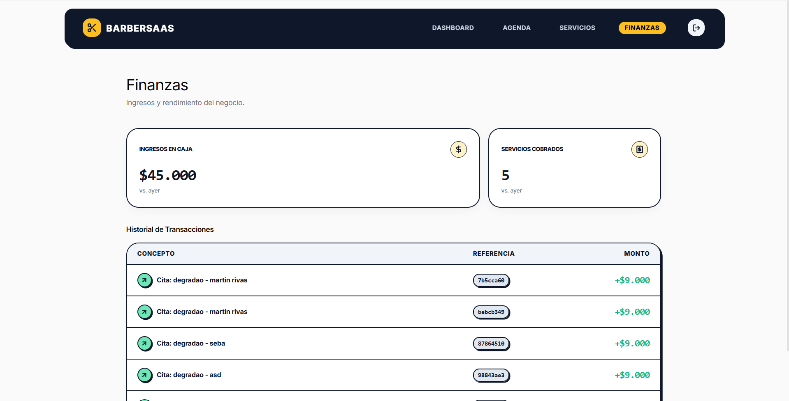
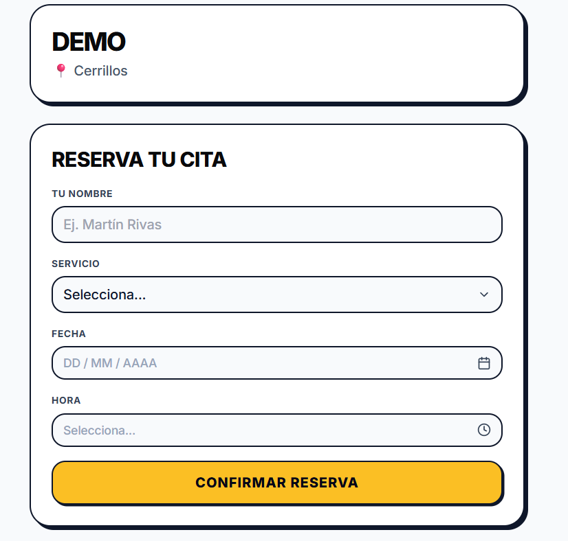

# BarberSaaS

<p align="center">
  
</p>

<h1 align="center">✂️ BarberSaaS</h1>

<p align="center">
  Modern SaaS Platform for Multi-Tenant Barbershop Management
</p>

<p align="center">
  
  
  
  
  
</p>

<a href="https://barber-saas-cl.vercel.app/b/estilo-urbano">
  
</a>

BarberSaaS es una aplicación web desarrollada para la administración de barberías bajo un modelo **SaaS multi-tenant**, donde múltiples negocios pueden operar de forma independiente sobre una misma plataforma. La aplicación permite gestionar la operación diaria de una barbería mediante un panel administrativo, ofreciendo herramientas para la administración de citas, servicios, ingresos y reservas públicas.

## La arquitectura está basada en una aplicación React desplegada como Single Page Application (SPA) que se comunica directamente con Supabase para autenticación, almacenamiento y consultas de datos, sin un servidor backend tradicional.

# Características principales

* Gestión de múltiples barberías mediante un modelo multi-tenant.
* Panel administrativo para cada barbería.
* Gestión de citas.
* Catálogo de servicios.
* Registro y visualización de ingresos.
* Dashboard con métricas operacionales.
* Página pública para reservas mediante URL personalizada.
* Gestión de empleados y roles (estructura presente en el proyecto).
* Integración con Supabase como plataforma Backend-as-a-Service (BaaS).

---

# Arquitectura

La aplicación sigue una arquitectura **Frontend + BaaS**, donde React actúa como cliente y Supabase proporciona los servicios backend.

```text
Usuario
    │
    ▼
React + Vite
    │
    ▼
Supabase JS
    │
    ├── Authentication
    ├── PostgREST
    └── PostgreSQL
```

Actualmente no existe un backend propio, API REST personalizada ni funciones Edge que intermedien entre el cliente y la base de datos. Toda la lógica de negocio reside principalmente en el frontend y en la base de datos.

---

# Tecnologías utilizadas

## Frontend

* React 18
* TypeScript
* Vite
* React Router
* Tailwind CSS
* Framer Motion
* Lucide React

## Backend

* Supabase
* PostgreSQL
* PostgREST

## Despliegue

* Vercel

## Herramientas

* npm
* Node.js
* TypeScript

---

# Estructura del proyecto

```text
BarberSaaS/
│
├── src/
│   ├── components/
│   ├── views/
│   ├── services/
│   ├── appointments/
│   ├── config/
│   ├── lib/
│   └── styles/
│
├── db/
│   ├── schema.sql
│   └── migrations/
│
├── supabase/
├── public/
│
├── package.json
├── vite.config.ts
├── tailwind.config.js
├── vercel.json
└── index.html
```

La organización del proyecto separa la interfaz de usuario, los servicios de acceso a datos, la configuración de Supabase y los scripts SQL utilizados para la base de datos.

---

# Requisitos

Antes de ejecutar el proyecto es necesario contar con:

* Node.js 20 o superior.
* npm.
* Proyecto de Supabase configurado.
* Variables de entorno correspondientes.
* Cuenta en Vercel (opcional para despliegue).

---

# Instalación

```bash
git clone https://github.com/usuario/BarberSaaS.git

cd BarberSaaS

npm install
```

Crear el archivo de variables de entorno y posteriormente ejecutar:

```bash
npm run dev
```

Para generar la versión de producción:

```bash
npm run build
```

Para visualizar la compilación:

```bash
npm run preview
```

Los scripts disponibles corresponden a los definidos en el proyecto mediante Vite.

---

# Configuración de Supabase

El proyecto utiliza Supabase como plataforma principal para:

* Base de datos PostgreSQL.
* Autenticación.
* Acceso mediante PostgREST.
* Gestión de datos de la aplicación.

La configuración del cliente se realiza desde el módulo correspondiente dentro de `src/config/`, utilizando las credenciales del proyecto de Supabase.

---

# Variables de entorno

Crear un archivo `.env` con las credenciales de Supabase:

```env
VITE_SUPABASE_URL=tu_url
VITE_SUPABASE_ANON_KEY=tu_clave
```

Estas variables permiten inicializar el cliente de Supabase desde el frontend.

---

# Ejecución en desarrollo

Iniciar el servidor de desarrollo:

```bash
npm run dev
```

Vite iniciará la aplicación y habilitará Hot Module Replacement (HMR) para facilitar el desarrollo.

---

# Despliegue

La aplicación está preparada para desplegarse como una **Single Page Application** utilizando **Vercel**.

La configuración del proyecto incluye reglas de reescritura para que React Router gestione correctamente las rutas desde el navegador.

---

# Modelo Multi-Tenant

BarberSaaS implementa un modelo **Shared Schema Multi-Tenant**, donde varias barberías comparten una misma base de datos diferenciando la información mediante un identificador de barbería.

Cada barbería representa un tenant independiente.

## Las entidades principales (usuarios, citas, ingresos y servicios) se encuentran asociadas a una barbería mediante su identificador correspondiente, permitiendo aislar la información lógica de cada negocio dentro de la misma infraestructura.

# Estructura de la base de datos

El modelo de datos se organiza principalmente alrededor de las siguientes entidades:

* **Barberías**

  * Información de cada negocio.

* **Usuarios**

  * Empleados y administradores.

* **Servicios**

  * Catálogo de servicios ofrecidos.

* **Citas**

  * Agenda de reservas.

* **Ganancias**

  * Registro de ingresos asociados a la operación.

Estas entidades constituyen el núcleo funcional del sistema y soportan la operación diaria de cada barbería.

---

# Estado actual del proyecto

Actualmente BarberSaaS dispone de una base funcional que incluye las principales operaciones de administración de una barbería, incorporando gestión de citas, servicios, métricas e ingresos dentro de un entorno multi-tenant.

La arquitectura está orientada a una solución SaaS y constituye una base sólida para futuras mejoras y ampliaciones funcionales.

---

# Capturas

## Dashboard



## Agenda



## Servicios



## Finanzas



## Reserva pública



---

# Licencia

Copyright © 2026 Martin Rivas.

Todos los derechos reservados.

BarberSaaS es un software propietario desarrollado por Martin Rivas.

Ninguna parte de este proyecto, incluyendo su código fuente, arquitectura, documentación, diseños, recursos o cualquier otro material contenido en este repositorio, podrá ser copiada, modificada, distribuida, publicada, sublicenciada, comercializada o utilizada, total o parcialmente, sin la autorización previa y por escrito del autor.

Este repositorio se proporciona únicamente con fines informativos o de demostración, cuando corresponda, y no concede ninguna licencia de uso sobre la propiedad intelectual del proyecto.
